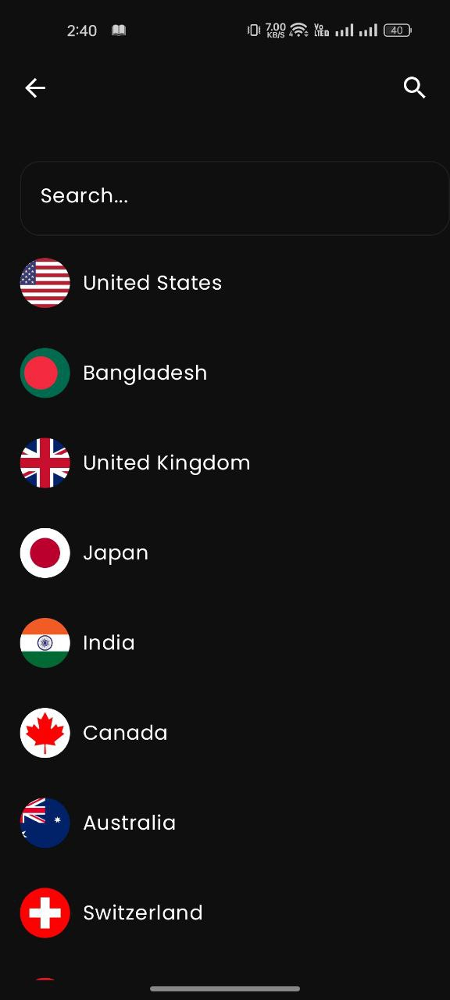
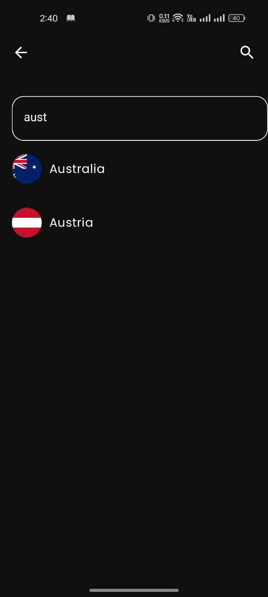

# 🌍 Currency Converter App

A modern and intuitive Android app for converting currencies between countries in real time. It features a complete list of countries and supports all major currencies. Built using Jetpack Compose and MVI architecture for a clean and maintainable codebase.

## ✨ Features

- 🌐 Real-time currency conversion
- 🌍 Full list of countries and their currencies
- ⚡ Built with Jetpack Compose and MVI architecture
- 🚀 Smooth performance with Coroutines and StateFlow
- 🔓 Powered by a free and open-source currency API

## 🎯 Tech Stack

- **Kotlin**
- **Jetpack Compose**
- **MVI Architecture**
- **ViewModel + StateFlow**
- **Coroutines**
- **[Exchange API](https://github.com/fawazahmed0/exchange-api)**

## 🔗 API Used

This app uses a free and open-source currency conversion API:  
**[exchange-api](https://github.com/fawazahmed0/exchange-api)**

## 📸 Screenshots

| Home Screen | Country Screen |
|-------------|----------------|
|  |  |

| Search | No Result |
|--------|-----------|
|  |  |

## 📦 Getting Started

1. **Clone the repository:**

```bash
git clone https://github.com/zarenth/Currency-Converter.git
```

## If you like this project, please consider giving it a ⭐ on GitHub:  
👉 [Star this repository](https://github.com/zarenth/Currency-Converter)
